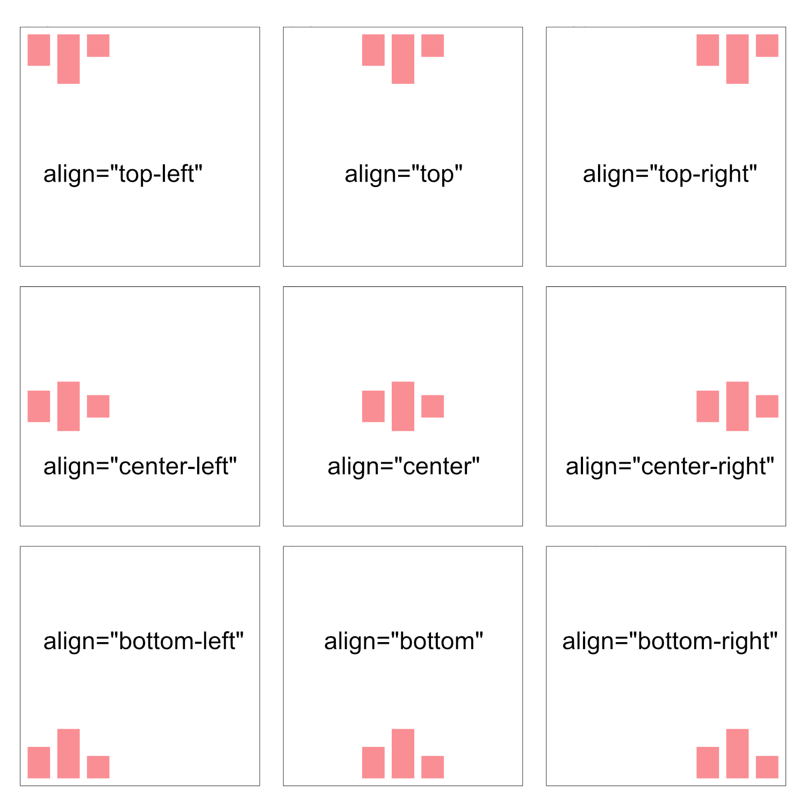

# Figma auto layout - Web components

Do you ever dreamed about used the figma auto-layout into your project like your designer? You are in the good place.

Create easely thing with the auto-layout web component.


## Features

- Layout direction
- Space between items
- Padding
- Spacing mode
- Height and Width
- Clip content

## Override

	--xx-small	: 4px
	--x-small	: 8px
	--small		: 16px
	--medium	: 24px
	--regular	: 32px
	--large		: 40px
	--x-large	: 56px
	--xx-large	: 64px

## Usage

### Define
You can use the auto-layout with a balise
```html
<auto-layout>
    ...
</auto-layout>
```

Or apply an argument into any balise like
```html
<div auto-layout></div>
<section auto-layout></section>
<button auto-layout></button>
```

### Direction

First, you may set the layout direction to your content, by default it's vertical
```html
// Vertical
<auto-layout direction="vertical">
    ...
</auto-layout>
<auto-layout>
    ...
</auto-layout>

// Horizontal
<auto-layout direction="vertical">
    ...
</auto-layout>
```


### Alignment

#### Value
	top-left
	top
	top-right
	center-left
	center
	center-right
	bottom-left
	bottom
	bottom-right


```html
<auto-layout align="...">
    ...
</auto-layout>
```


### Space between items
By default, no space between items are set. You can set a variable or a number.
```html
<auto-layout [...] gap="small">
    // OR
<auto-layout [...] gap="16">
```


### Padding
By default, no padding are set. You can set a variable or a number.
```html
<auto-layout [...] padding="small">
    // OR
<auto-layout [...] padding="16">
```


You can set only the top and bottom or the left and right like this
```html
<auto-layout [...] padding-vertical="small">
<auto-layout [...] padding-horizontal="small">
```

You also can apply for a single edge
```html
<auto-layout [...] padding-top="small">
<auto-layout [...] padding-bottom="small">
<auto-layout [...] padding-left="small">
<auto-layout [...] padding-right="small">
```

Of course, they are cumulable
```html
<auto-layout [...] padding-top="small" padding-horizontal="regular">
```

### Spacing mode


```html
<auto-layout [...] space-between>
```


### Height and width

You can define a height and with to your auto-layout.
You can use number or value.

```html
<auto-layout [...] height="300" width="450">
```


#### Fill container
To fill the parent, you can use "fill" or "fill-container"
```html
<auto-layout [...] width="fill" height="200">
```


#### Hug content
By default, the auto-layout use the "hug" or "hug-content"
```html
<auto-layout [...] width="hug" height="200">
```


### Clip content

If you need to keep your content inside the auto-layout, you can add an argument "clip" or "clip-content"

```html
<auto-layout [...] clip>
```


## Run Locally

Clone the project

```bash
  git clone git@github.com:melvindesign/auto-layout.git
```

Go to the project directory

```bash
  cd auto-layout
```

Install dependencies

```bash
  npm install
```

Start the server

```bash
  npm run start
```


## Authors

- [@melvindesign](https://www.github.com/melvindesign)


## Tech Stack

**SCSS**, **StencilJS**

## License

[](https://choosealicense.com/licenses/mit/)


